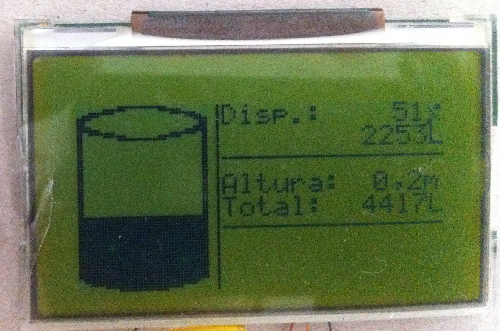

# Well level

This project was developed to get the water level information of a well that supplies a residential home. It is based on a JSN-SR04T-2.0 distance measurement sensor a STM32F030F4P6 development board and a 128x64 monochrome lcd.

## Connections

The system is powered from the usb port available on the STM32F030 development board and the sensor is connected to serial port which was configured to work on mode 3 (serial) as described on datasheet. The lcd display has a KS0713 based controller working on spi mode using the bellow connections.

<pre>
STM32F030           Display
    PA5    ----->    CLK
    PA6    ----->    RS
    PA7    ----->    SDI
    PB1    ----->    RST
</pre>

## Information displayed

The information displayed oj the display is very basic, having a graphic representation the left side and details on left.
Top right shows the available capacity in % and liters, right middle the water hight and below the maximum capacity. On bottom right it is displayed an icon if errors occur when communicating with the sensor.

## Configuration

As this system was developed with the intention of installation and forget, due to that it has no interface for entering well dimensions. These configurations are defined on the code then compiled and written to flash.

### Configuration symbols

On [well_level.c](src/well_level.c) file are defined four symbols that are required to get correct values.

- `#define DIAMETER x.xf` Float number defining the of the well diameter 
in meters.
- `#define HEIGHT x.xf` Float number defining the of the well hight 
in meters.
- `#define MAX_HIGHT` Integer number defining the maximum water level in mm
- `#define SENSOR_OFFSET` Integer number defining the distance between the sensor and the maximum water level in mm

Example of installation:
<pre>
 +---------- # ---+  <- Sensor
 |                |
 |~~~~~~~~~~~~~~~~|  <- Maximum level
 |                |
 |                |
 |                |
 |                |
 |                |
 |________________|
</pre>

For compilation run `make` command